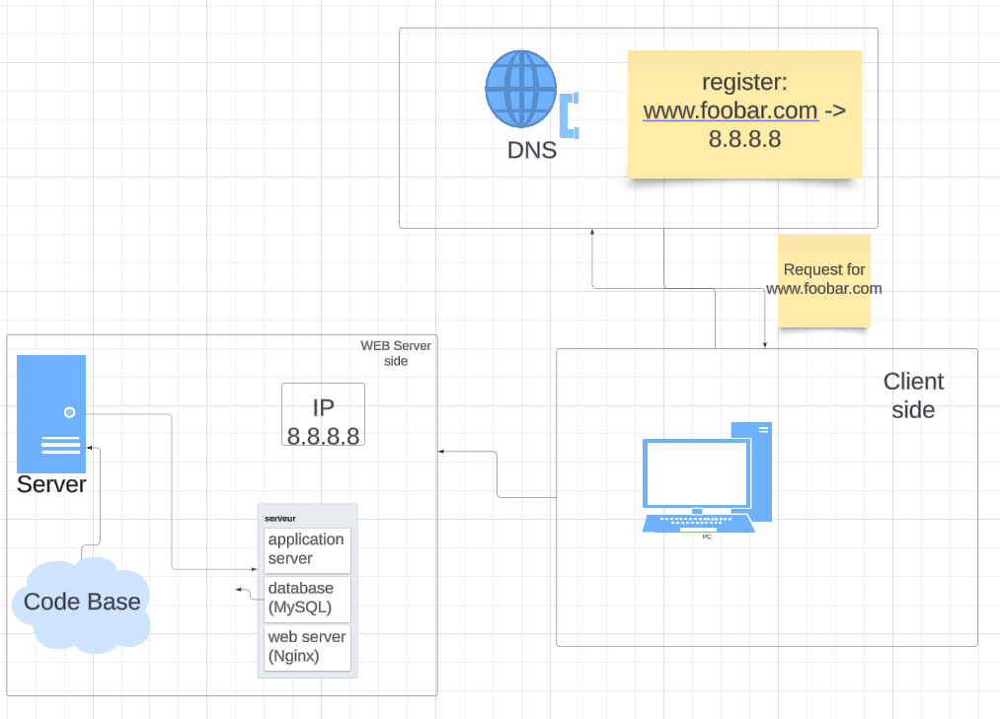

# Simple Web Stack

## Description
This is a simple web infrastructure that hosts a website that is reachable via `www.foobar.com`

## Specifics About This Infrastructure
+ In computing, a server is a piece of computer hardware or software (computer program) that provides functionality for other programs or devices, called "clients"
+ Domain names serve to identify Internet resources, such as computers, networks, and services, with a text-based label that is easier to memorize than the numerical addresses used in the Internet protocols
+ `www` in the DNS is a `CNAME` record it is a type of DNS record that maps an alias name to a true or canonical domain name
+ The primary role of a web server is to store, process, and deliver requested information or webpages to end users
+ The function of the application server is to act as host (or container) for the user's business logic while facilitating access to and performance of the business application
+ The primary purpose of a database is to store, retrieve, and update information. A database can be used to store data related to any aspect of business operations.
+ Web servers and application servers typically communicate using protocols like HTTP

## Issues With This Infrastructure

+ There are multiple SPOF (Single Point Of Failure) in this infrastructure. For example, if the MySQL database server is down, the entire site would be down.

+ Downtime when maintenance needed. When we need to run some maintenance checks on any component, they have to be put down or the server has to be turned off. Since there's only one server, the website would be experiencing a downtime.

+ Cannot scale if there's too much incoming traffic. It would be hard to scale this infrastructure becauses one server contains the required components. The server can quickly run out of resources or slow down when it starts receiving a lot of requests.
