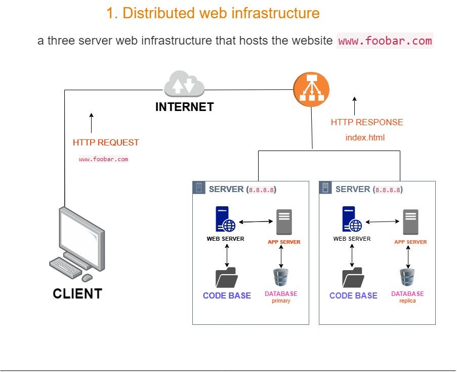

# Distributed Web Infrastructure

## Description
Distributed web infrastructure refers to the concept of distributing the components of a website across multiple servers or devices, rather than hosting everything on a single server.

## Specifics About This Infrastructure
+ Load balancers are used to distribute network traffic across multiple servers. This helps to ensure that no single server becomes overwhelmed with requests, improving the overall performance and reliability of the system.
+ Round Robin: This method distributes incoming requests to backend servers in a circular fashion. The process sends requests sequentially to each server, with each server being assigned a number. This method ensures that each server receives an equal amount of requests, making it an excellent choice when we have a collection of servers with similar capabilities.
+ In an active-passive configuration, the server load balancer recognizes a failed node and redirects traffic to the next available node. In an active-active configuration, the load balancer spreads out the workload's traffic among multiple nodes   The HAProxy load-balancer is enabling an Active-Passive setup rather than an Active-Active setup
+ It involves a primary/master database server that accepts both read and write operations and one or more secondary/slave servers that replicate data from the primary server. Read operations can be distributed to the slave servers, offloading the read workload from the primary server.
+ Read and Write Split: The primary handles writes, while replicas handle read queries, thereby distributing the load.

## Issues With This Infrastructure
+ There are multiple SPOF (Single Point Of Failure). For example, if the Primary MySQL database server is down, the entire site would be unable to make changes to the site (including adding or removing users). The server containing the load balancer and the application server connecting to the primary database server are also SPOFs.
+ Security issues. The data transmitted over the network isn't encrypted using an SSL certificate so hackers can spy on the network. There is no way of blocking unauthorized IPs since there's no firewall installed on any server.
+ No monitoring. We have no way of knowing the status of each server since they're not being monitored.
